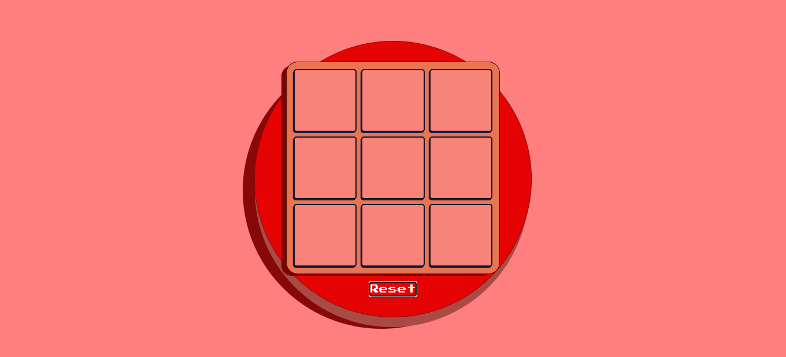
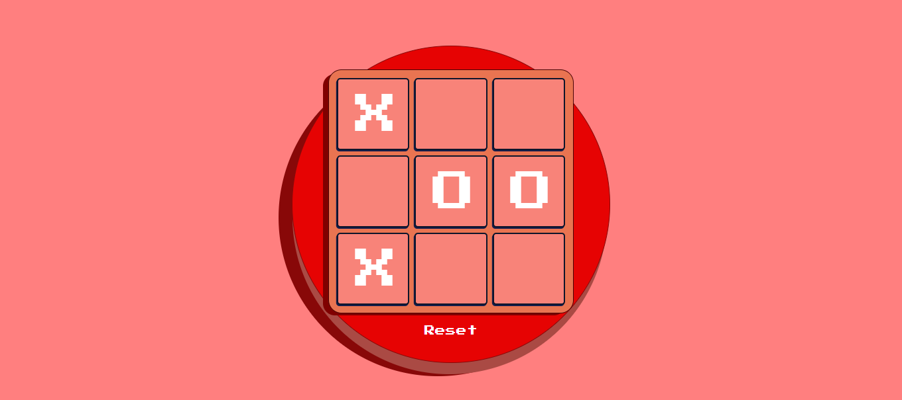
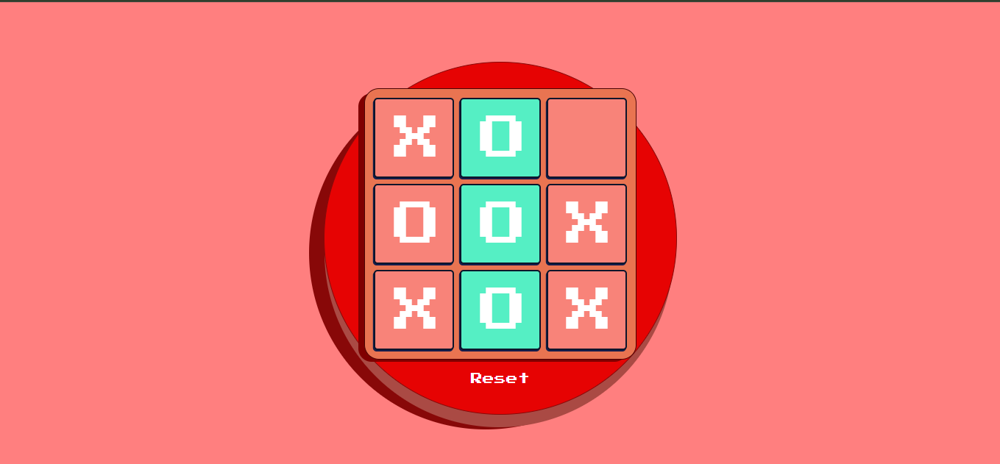

# Tic Tac Toe Game

Welcome to the Tic Tac Toe Game project! This is a simple implementation of the classic game built using HTML, CSS, and JavaScript.

## How to Play

To play the game, simply open the `index.html` file in your favorite text editor and start a live server. This will launch the game in your browser, where you can then start playing against another player.

## Features

- **Player vs. Player mode:** Play against another player on the same device.
- **Interactive UI:** Click on the game board to make your moves.
- **Winning Detection:** The game detects winning combinations and highlights the winning cells.

## Getting Started

1. Clone the repository to your local machine:
   git clone https://github.com/your-username/tic-tac-toe.git
2. Navigate to the project directory:
   cd tic-tac-toe
3. Open the `index.html` file in your text editor.

4. Start a live server to launch the game in your browser.

5. Enjoy playing Tic Tac Toe!

## Screenshots

## Technologies Used

- HTML
- CSS
- JavaScript

## Credits

This project was created by Abdulkarim Mussa Natty. Feel free to contribute to the project by submitting pull requests or reporting issues.
